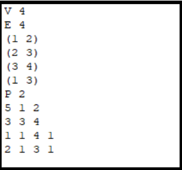
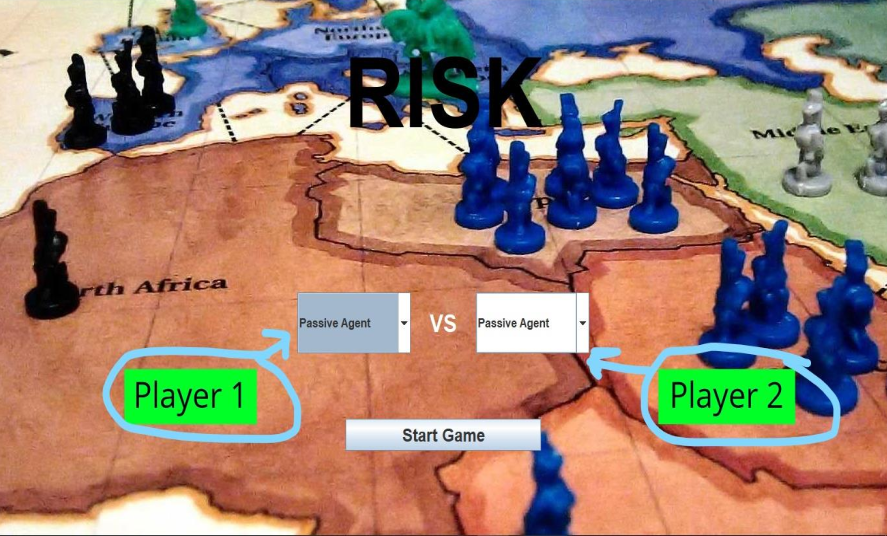
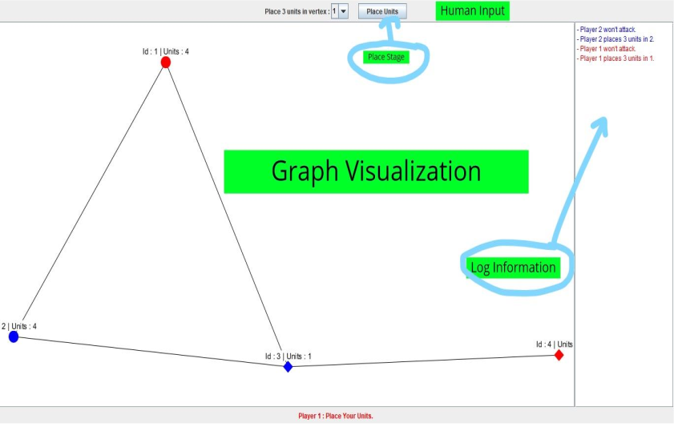
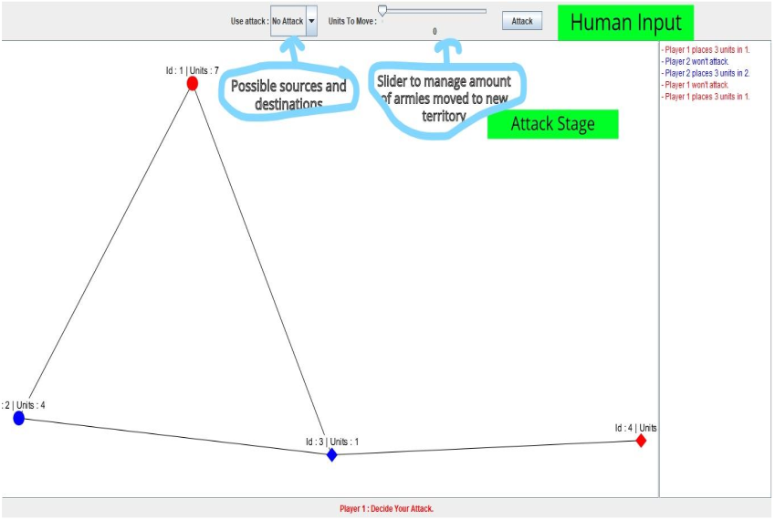

# Risk simulation using AI agents
---
## Overview 
In this assignment, a simple environment simulator that generates instances of a search problem, runs agent programs, and evaluates their performance according to a simple performance measure for RISK. The search problem that was used is a simplified and abstract version of the board game RISK. Also, it’s required to implement different types of AI and non-AI agents.

---
## Agents
* Human agent : input from user
* Passive agent : non-AI agent, places all its bonus armies on the vertex with the fewest number of armies, and never attack.
* Aggressive agent : non-AI agent, places all its bonus armies on the strongest vertex. It wants to cause the maximum damage to the opponent player as well.
* Pacifist agent : non-AI agent, imitates the previously-mentioned passive one for the placement stage. On the other hand, it takes the safest side for attack stage, and attacks the vertex with the least number of armies.
* Greedy agent : AI agent, takes the move with the best immediate heuristic value.
* A* agent : applies A* search algorithm to decide the next move.
* RTA A* agent : applies A* search algorithm limited to 4 search levels to decide the next move.
---
## Assumptions
* The Initial placement of armies is determined as part of the input, such that the given file format is extended by extra two lines. The first line is for the first player, and the second one is for the other. Each line follows the format shown below: territory 1 armies 1 ... territory n armies n , where n is the number of territories owned by that player.
* For pacifist and aggressive agents, it’s assumed that the agent leaves only one army in the attacking territory and moves all the remaining armies into the new one.
* RTA* uses a maximum search limit of 4 levels.
* AI agents are programmed to search against a passive agent.
* The actual cost is the number of turns from the game start till the current one.
---
## Screenshots
Screenshots of the application and input file with explanation annoted on them.
### Input File Example

### UI 

---